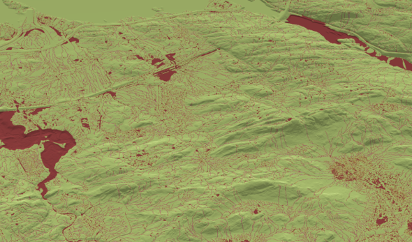

# SWIM - Surface Water Integrated Modeling

SWIM is an open-source software package for static modeling and prediction of
surface water and urban flooding based on analysis of topography/terrain. It is
developed and maintained by the [Applied Computational
Science](https://www.sintef.no/en/digital/departments-new/department-of-mathematics-and-cybernetics/research-group-applied-computational-science/)
research group at [SINTEF Digital](https://www.sintef.no/en/digital/).

SWIM consists of a collection of algorithms for analysing terrain, identifying
watershed boundaries, and providing a better understanding of how water
accumulates and moves through the landscape. This is valuable for various
purposes, such as water resource management, flood modeling, and environmental
planning.

Our algorithms originate from work on CO2 storage and are based on an assumption
of infinitesimal flow. These so-called spill-point analyses were later modified
to model flooding in urban areas. Spill-point analyses are highly
computationally efficient compared to tools based on numerical simulation. This
makes it easy to work interactively and test out various scenarios and
measures. SWIM offers some unique functionality, such as simplified infiltration
models (both permeable and impermeable surfaecs) and the calculation of time
series that models how water accumulates or drains over time, without having to
resort to computationally intensive numerical time-stepping approaches.

## Functionality

SWIM is a set of tools that is intended to provide a flexible foundation for
further development. Current functionality includes:

- Static surface models
  - Calculation of catchment areas, waterways, and hierarchical networks of
    intermittent streams, ponds and lakes
  - Accumulation areas for water, topological network of ponds, and how they
    connect and merge together
  - Permanent water volumes such as rivers, lakes, and seas
- Dynamic analysis
  - Terrain response to precipitation events and infiltration over time
  - Routing of water as ponds overflow
- Terrain characteristics and infrastructure
  - Buildings, obstacles, drainage, and measures
  - Simplified infiltration model that supports both permeable and impermeable
    surfaces
- Basic IO and visualization routines

*System of lakes and rivers identified in the watershed analysis.*

## Learn more

The best way to get introduced to SWIM is to have a look at the provided
examples:
- The [Urban landscape](https://sintefmath.github.io/SurfaceWaterIntegratedModeling.jl/dev/urban/)
  example provides an introduction to key SWIM functionality applied to a real
  dataset of a district in central Oslo.
- The [Simple synthetic example](https://sintefmath.github.io/SurfaceWaterIntegratedModeling.jl/dev/synthetic/)
  uses an extremely simplified surface to explain and demonstrate some key concepts.
- The [Handling flat areas](https://sintefmath.github.io/SurfaceWaterIntegratedModeling.jl/dev/flat_areas/)
  example is a small example to show how large, flat water bodies can be
  identified and kept separate from the analysis.

## License information

Copyright (c) 2024 SINTEF Digital

Licensed under the Apache License, Version 2.0 (the "License");
you may not use this file except in compliance with the License.
You may obtain a copy of the License at

    http://www.apache.org/licenses/LICENSE-2.0

Unless required by applicable law or agreed to in writing, software
distributed under the License is distributed on an "AS IS" BASIS,
WITHOUT WARRANTIES OR CONDITIONS OF ANY KIND, either express or implied.
See the License for the specific language governing permissions and
limitations under the License.
