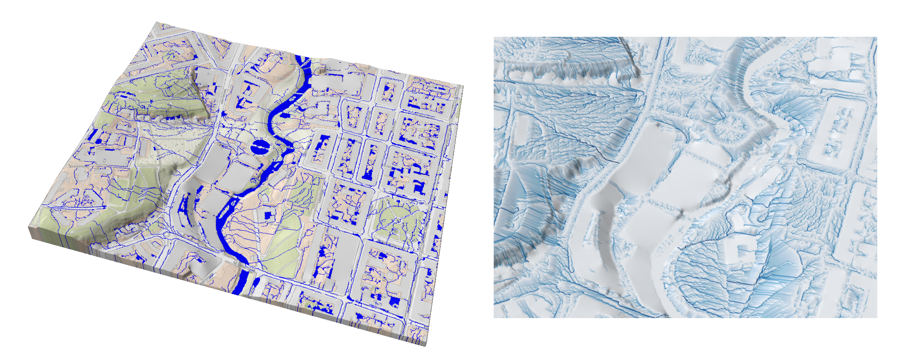

# Summary

SWIM (Surface Water Integrated Modeling) is a Julia software package for static
modeling and prediction of surface water and urban flooding based on analysis of
terrain topography, terrain properties, and infrastructure.

SWIM consists of a collection of algorithms for analyzing terrain, identifying
watershed boundaries, and providing a better understanding of how water
accumulates and moves across the landscape.  Such analyses are valuable for
various purposes, including water resource management, flood modeling and
mitigation, and environmental planning.

The algorithms are based on the assumption of infinitesimal flow and the
identification of _spill points_.  Spill-point analyses are highly
computationally efficient compared to tools based on numerical
simulation. Spill-point analyses are highly computationally efficient compared
to tools based on numerical simulation, making it easy to work interactively and
test out various scenarios and measures. SWIM offers unique functionality, such
as simplified infiltration models for both permeable and impermeable surfaces,
as well as the calculation of time series that model how water accumulates or
drains over time without resorting to computationally intensive numerical
time-stepping approaches.

# Statement of need

The damage caused by intense rainfall in urban areas can be extremely
costly. The stormwater problem is also becoming more severe due to population
growth, urban densification, and increasingly frequent extreme weather events.
The need for long-term adaptation and planning is therefore increasingly urgent,
as is the need for adequate digital tools.

Limitation on and lack of data often makes modeling and prediction of stormwater
flow related to intensive rainfall challenging [@Skaugen:2020]. Mathematical
approaches to evaluate uncertainties [@Beven:2003], [@Zhang:2019] typically rely
on the ability to run large numbers of simulations and scenarios.  However, use
of complex hydrological simulators [@Langevin:2017], [@MIKESHE] are
computationally very expensive and may render the analysis intractable for many
applications and potential users.

In urban areas with extensive impervious surfaces, topography is typically the
primary driver of stormwater flow patterns and local accumulation of surface
water.  GIS-based models operate on a simplified premise where surface flow is
solely determined by topography, and can provide an attractive modeling
alternative [@Skaugen:2014], [@ARCGIS], [@SCALGO].  Such models are generally
easy to set up and run, and require considerably fewer computational resources
than complex hydrological simulators do.  However, drawbacks include:

- Typically no ability to handle temporal developments or infiltration.
- Sensitive to data resolution and uncertainties.
- Lack of open-source alternatives adaptable to particular user or researcher needs.

In response to these shortcomings, SWIM was developed as a computationally
efficient, flexible open-source prototyping software library for stormwater
modeling.  It builds upon a GIS-based modeling approach, while enabling
extension and generalization of the methodology.

# Functionality

SWIM is implemented in Julia, with computational performance as a key
goal. Input data consists solely of raster data (2D matrices), for
topography, terrain features, infrastructure and weather data. Functionality
includes:

- Static analysis, including delineating hierarchies of traps (lakes) and
  intermittent rivers, identifying corresponding watersheds, and estimating flow
  intensities across terrain.
- Integrating terrain characteristics into the analysis, including permanent
  water bodies (rivers, lakes, ocean), buildings, obstacles and drains.
- Simplified infiltration model that supports both permeable and impermeable
  surfaces.
- Dynamic analysis, including terrain response to precipitation events and
  infiltration over time, and routing of waters as ponds overflow.

# Principle of topography-based analysis

## Spill regions and flow graph

Although input data consists of raster grids, the terrain and its properties is
internally represented as directed graphs, which form the basis of analysis.

The flow graph describes how water flows over the terrain from one node (grid
cell) to the next.  To create this graph from a digital elevation model (DEM),
SWIM uses a deterministic eight-node (D8) single-flow direction (SFD) algorithm
[@Wilson:2008] which generates a tree-structured, generally disconnected flow
graph \autoref{fig:upnode}. Using the D8 algorithm, flow from a given node is
always directed towards its steepest downhill neighbor, if any.

{width=100%}

Once generated, most analysis is done directly on the flow graph using standard
graph concepts and algorithms. For instance, root nodes represent accumulation
points in the terrain, connected components represent the associated watersheds,
and flow intensity at a given node is obtained by integrating precipitation
over all its upstream nodes.

## Topological structure of lakes and rivers

The spill graph serves as input to define a higher-level graph of traps
("ponds", "lakes") and the intermittent stream connecting them.  Traps are
delineated by identifying _spill points_ (lowest elevation node along the
boundary of the catchment area for a given accumulation point).  A trap will
fill up until its water level reaches the spillpoint, at which point it will
overflow. Small traps typically coalesce into larger traps as they fill up,
thereby defining a hierarchy of sub-traps and super-traps.  An example of a
_trap structure graph_ representing both the upstream/downstream and the
sub-trap/super-trap relationships between traps is shown in
\autoref{fig:trap_structure}.

{width=100%}

The concepts are illustrated on a simple synthetic surface in
\autoref{fig:synthetic_matrix}. On the upper row, the green and red traps are
sub-traps of the orange trap, which again is an upstream trap to the blue one.
On the lower row, we see how water gradually accumulates, making the sub-traps
coalesce, and finally how water spills over to the downstream trap.

{width=100%}

## Infiltration and time series

The routing of water across the terrain at any given time depends on the current
state of each trap (whether it is still filling up or spilling over), current
precipitation rate (which may vary spatially), and the rate of infiltration at
each point. Infiltration at each node happens at a fixed rate (zero for
impervious regions) capped by the node's current inflow rate. For a given
weather scenario, specified infiltration rates and an initial status (typically
empty) for each trap, it is possible to construct a sequence of events that
identifies the moment in time when each trap fills up, and how this influences
the subsequent routing of water. This allows the user to determine the surface
water flow and and extact water content of each trap at any given moment, how
long it takes for each trap to fill up, where water currently is accumulating,
and more.

# Example

The following brief example demonstrates the application of some basic SWIM
functionality on real data. \autoref{fig:vulkan_model} presents a DEM of the
Vulkan neighborhood around the Akerselva river in central Oslo, along with four
stencils which serves as additional input to the analysis, all provided as
raster grids with the same resolution.

{width=100%}

The end state of a scenario with constant precipitation until all traps have
been filled is shown in \autoref{fig:vulkan_analysis}. Here, all traps and the
intermittent streams connecting them are shown on the left plot.  The right plot
shows a cutout where the logarithm of flow intensity has been visualized.

{width=100%}

For additional and more in-depth examples, the reader is encouraged to have a
look at the [online documentation](https://sintefmath.github.io/SurfaceWaterIntegratedModeling.jl/dev/).

# Acknowledgments
The data used in the example above was originally obtained from Kartverket (the
Norwegian Mapping Authority) under the Creative Commons Attribution 4.0
International (CC BY 4.0) license.

# References
