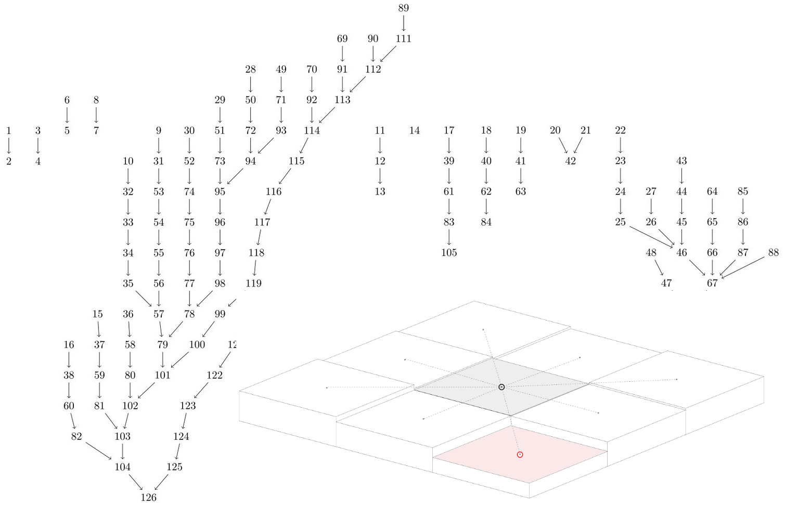

# Summary

Describe high-level functionality and purpose of the software, for a diverse,
_non-specialist_ audience.

Similar to an abstract.

# Statement of need

Clearly illustrates the research purpose of the software and places it in the
context of related work.

- flooding, both in the sense of urban flash floods and large-area flooding is
  becoming increasingly common due to climate change.
- Planning in a way that mitigates against flooding requires holistic thinking,
  as it cannot be done efficiently at the site level.  Easy to use tools that
  can do analysis on a wide geographical scale is important to facilitate
  collaboration between stakeholders.

- open source alternative
- topography-based modeling is typically static, and doesn't take infiltration
  or temporal developments into account.  On the other hand, PDE-based modeling
  is very computationally heavy.  We here propose a solution that is based on
  topography (and remains computaionally lightweight), while having a certain
  ability to model temporal developments.
- A model of infiltration is important when analysing/designing countermeasures

# Functionality

- Static analysis including delineating hierarchies of traps (lakes) and intermittent
  rivers, identify watersheds, estimate flow intensities
- Terrain characteristics and infrastructure (buildings, sinks, rivers/waterbodies)
- Infiltration
- Time-series (infiltration, weather evolution)

All input data is based on raster grids (topography, stencils, weather)

# Principle of topography-based analysis

## Spill regions and flow graph

While the input data is based on raster grids, these are converted internally to
directed graphs, which are the basis for analysis. 

Grid cells become nodes, and directed edges are identified using the 4-point or
8-point stencil (reference).

{width=80%}

Properties that can be deduced from graph analysis:
- connected components represent watersheds
- the root of each tree represents either the bottom of a trap, or the domain boundary
- flow paths are traced by following the graph
- flow intensities at a given node can be computed by integrating upstream
nodes, multiplied with precipitation intensities above these node
This is the upnode.

## Topological structure of lakes and rivers

{width=100%}

This is a trap structure.

{width=100%}

# Example

{width=100%}

This can be referenced using \autoref{fig:vulkan_model}.

{width=100%}

# Acknowledgments
- Kartverket
@Pearson:2017 test

Mention (if applicable) a representative set of past or ongoing research
projects using the software and recent scholarly publications enabled by it.
- SWIM/SWAMP
- SurbArea

# References
- Bok om hydrological modeling
- Some paper explaining the 4 and 8 stencils
- The NVE hydrological tool
- SWMM
- MikeSHE
- Scalgo

List of key references
